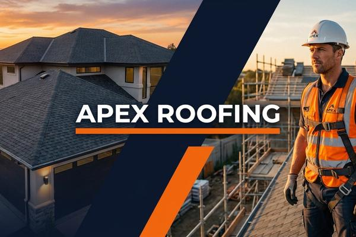

# Apex Roofing — Business Website



A fully responsive, multi-page business website for a residential and commercial roofing services company. Built with HTML5, CSS3, and vanilla JavaScript, the site is designed to generate leads through free-quote and inspection-request forms, showcase services and past projects, and build trust through testimonials, certifications, and clear service-area information.

---

## 📖 About

Apex Roofing is a premium roofing-services website offering a modern, conversion-focused homepage, a filterable services catalog, a dedicated roof-replacement/process page, an about/team page, a customer testimonials page, and a full contact page with an inspection-request form and embedded map — all connected by a shared responsive header and footer.

---

## 🛠 Tech Stack

- **HTML5** — semantic page structure
- **CSS3** — custom stylesheets per page
- **Vanilla JavaScript** — form validation, filtering, accordions, sliders
- **Google Fonts** — Inter & Outfit
- No backend / framework required — fully static

---

## 📄 Pages

| Page | File | Description |
|---|---|---|
| Home | `index.html` | Hero with quote form, stats, services overview, portfolio slider, process steps, testimonials, service areas, FAQs |
| Services | `services.html` | Filterable catalog of 6 services (Residential, Commercial, Emergency, Maintenance) |
| Why Choose Us | `roofreplacement.html` | Roof replacement process, material options, consultation form |
| About Us | `about.html` | Mission, values, leadership team, safety culture |
| Testimonials | `testimal.html` | Customer reviews and categorized FAQ |
| Contact | `contact.html` | Contact details, embedded map, inspection request form |

---

## ✨ Key Features

- Fully responsive layout with mobile navigation menu
- Multiple lead-capture forms with client-side validation
- Filterable services grid
- Before/after image slider
- FAQ accordions across pages
- Newsletter sign-up in the footer (site-wide)
- Embedded Google Map on the Contact page

---

## 📁 Project Structure

```
Roofing-Services/
├── index.html / index.css / index.js
├── services.html / services.css / services.js
├── roofreplacement.html / roofreplacement.css / roofreplacement.js
├── about.html
├── testimal.html / testimal.css / testimal.js
├── contact.html / contact.css / contact.js
└── images/
    ├── Thumbnail.jpeg
    ├── hero-bg.jpg
    ├── roofing-team.jpg
    ├── commercial-roof.jpg
    ├── brown-shingle-house.jpg
    ├── old-roof-before.jpg
    ├── new-roof-after.jpg
    ├── 1.png / 2.png / 3.png
```

---

## 🚀 Deployment

This is a static website with no server-side dependencies. It can be deployed on any static hosting provider:

1. Clone the repository
2. Upload the project files (or connect the repo) to your hosting provider (e.g. GitHub Pages, Netlify, Vercel)
3. Set `index.html` as the entry point / home page

```bash
git clone https://github.com/Career-dot/Roofing-Services.git
```

---

## 🔗 Repository

[github.com/Career-dot/Roofing-Services](https://github.com/Career-dot/Roofing-Services)
